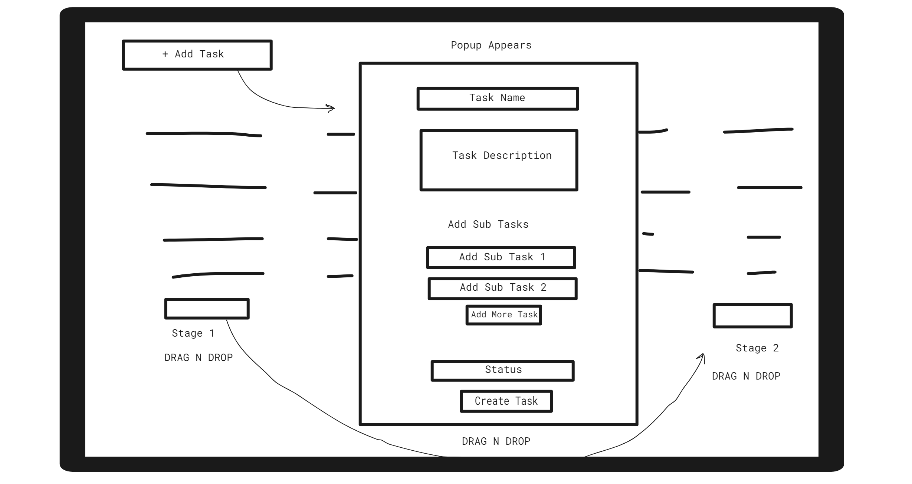

# React - Kanban


## Description
This board allows you to easily manage tasks by creating, editing, and moving them between four columns - To Do, In Progress, Testing, and Done. The application has been developed using React.js, Redux, and Tailwind CSS, resulting in an intuitive and user-friendly Kanban Dashboard.

### Here is the flow of how this application works
1. The user can create a task by clicking the Add Task button.
2. Popup will appear taking inputs from the user. 
3. The user can add input like ```Task Name, Description, SubTasks and Current Status```
3. When the user clicks on submit, a new task will be created with all details entered by the user.
4. The user can edit a task by clicking on any cards.
5. The user can drag tasks from one column to another.



### Here is the Proper File and Folder Structure:

```
├── public
│   ├── favicon.ico
│   ├── index.html
│   ├── logo192.png
│   ├── logo512.png
│   ├── manifest.json
│   └── robots.txt
├── src
│   ├── components
│   │   ├── SubTask.js
│   │   ├── Task.js
│   │   ├── Column.js
│   │   ├── Header.js
│   │   └── Home.js
│   ├── redux
│   │   ├── boardsSlice.js
│   │   └── store.js
│   ├── modals
│   │   ├── TaskModal.js
│   │   └── AssEditTaskModal.js
│   ├── App.js
│   ├── index.css
│   └──index.js
├── .gitignore
├── package.json
├── package-lock.json
├── tailwind.config.js
└── README.md
```

## Detailed Explanation

In this Kanban dashboard, I employed React.js and Redux to build the application. The foundational state of the application is encapsulated in the `store.js` file within the `redux` folder. The Kanban board is structured into four columns: "To Do," "In Progress," "Testing," and "Done." Each column is populated with a list of tasks, each comprising attributes such as "Task Name," "Description," "SubTasks," and "Current Status." Where the data is stored in the data.json.

To manage the state and actions for the Kanban board, I created the `boardsSlice.js` file in the `redux` folder. This file utilizes the `createSlice` function from Redux, consolidating various actions applicable to the Kanban board.

The `Home.js` file in the `components` folder contains the code relevant to the Kanban board. To access data from the `store.js` file, I utilized the `useState` and `useSelector` hooks from React.js. Additionally, the `useDispatch` hook is employed to dispatch actions to the `boardsSlice.js` file, facilitating state management.

Styling for the application is achieved using the `Tailwind CSS` framework and visually appealing user interface.
